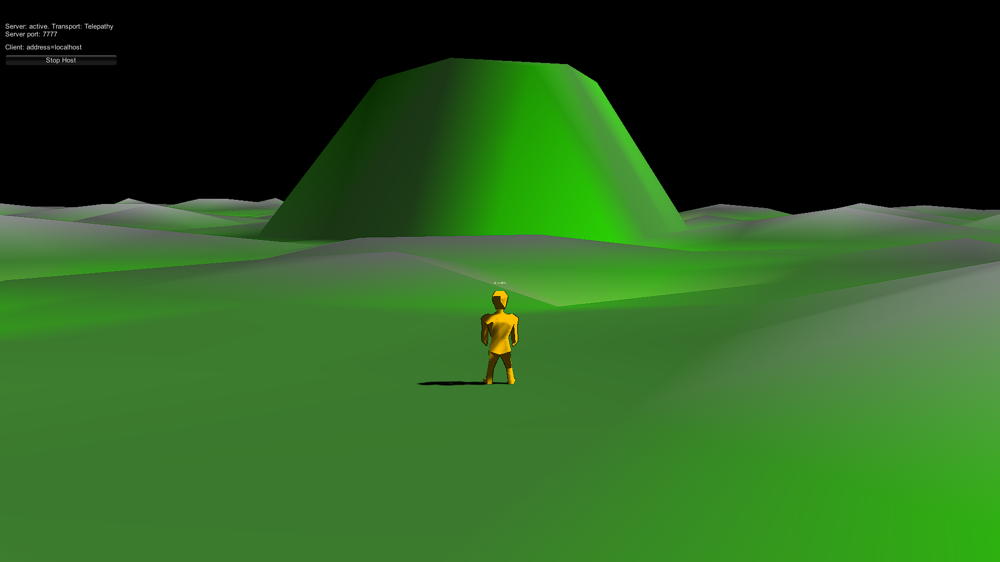
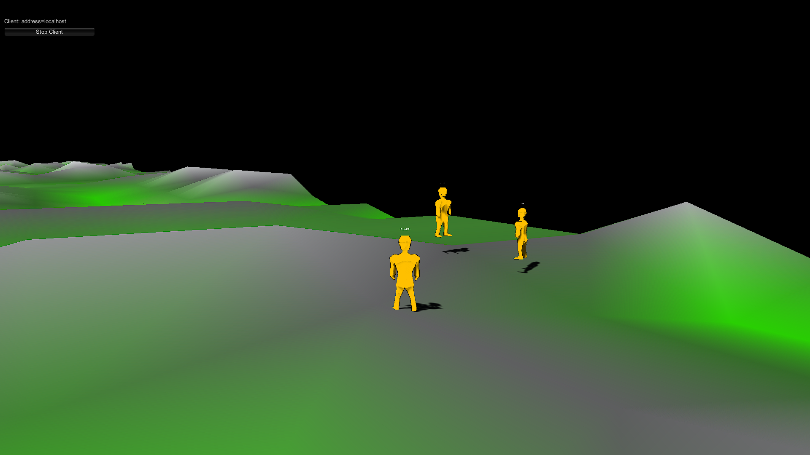

# Multiplayer_Sandbox
 
 ## Introduction
 A multiplayer, low-poly, sandbox style game for learning and educational purposes.
 
 ## Features
 * Multiplayer (currently supports 4 players)
 * Procedural world generation
 * Terraforming mechanics

## Planned Features
* Building mechanics
* Survival mechanics

 
 ## Screenshots
 
 
 
